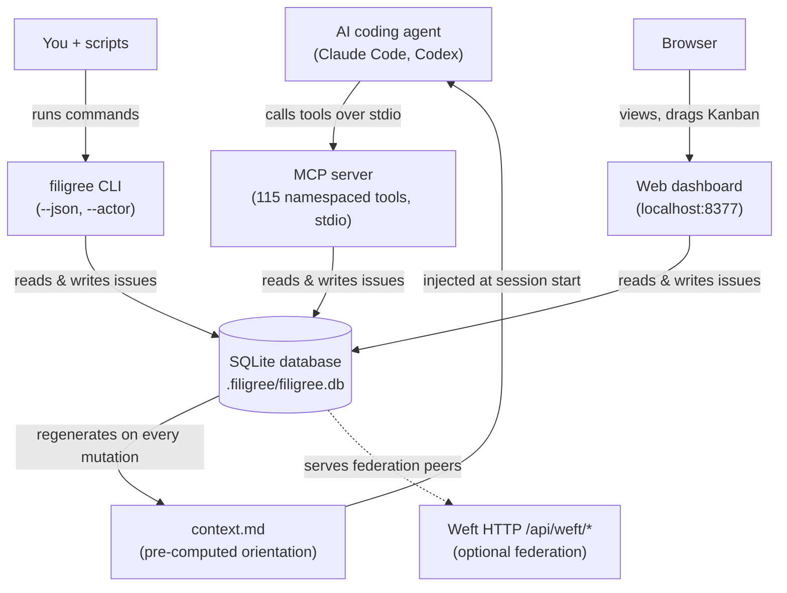
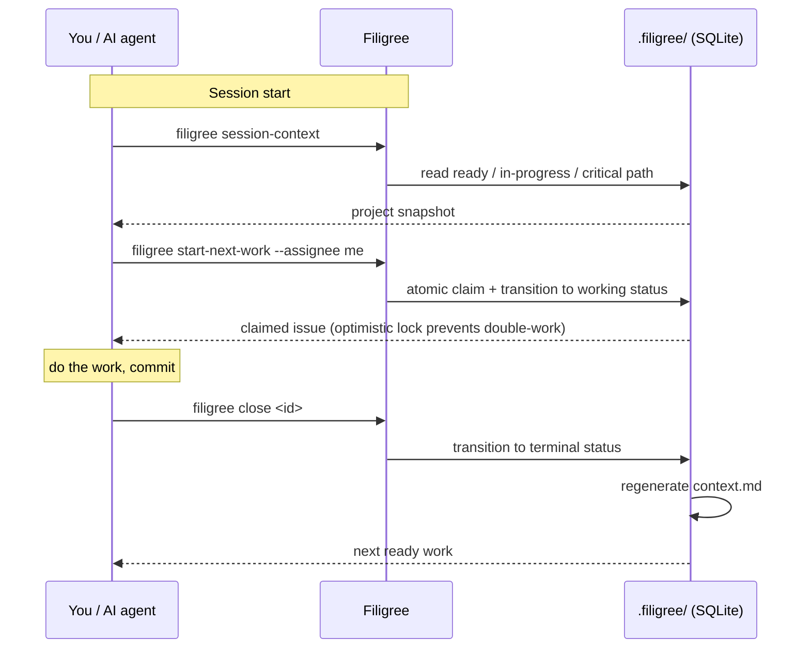
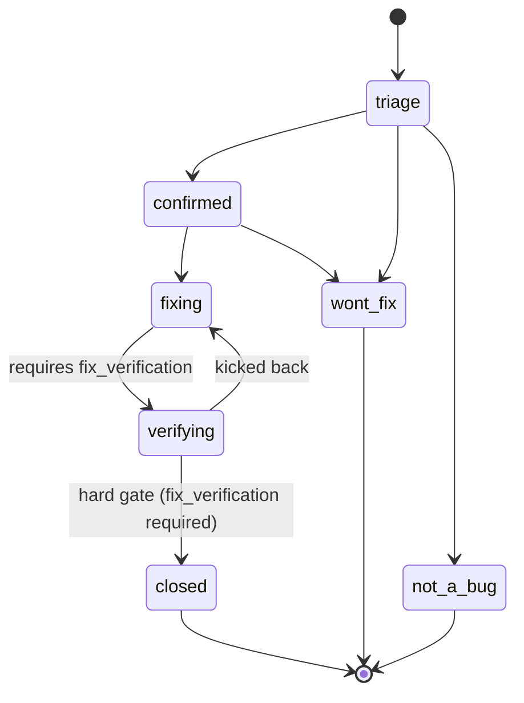

# Filigree

Local-first issue tracker designed for AI coding agents — SQLite, MCP tools, no cloud, no accounts.

[](https://github.com/foundryside-dev/filigree/actions/workflows/ci.yml)
[](https://pypi.org/project/filigree/)
[](https://pypi.org/project/filigree/)
[](https://github.com/foundryside-dev/filigree/blob/main/LICENSE)

## What Is Filigree?

Filigree is a lightweight, SQLite-backed issue tracker designed for AI coding agents (Claude Code, Codex, etc.) to use as first-class citizens. It exposes 116 MCP tools so agents interact natively, plus a full CLI for humans and background subagents.

Traditional issue trackers are human-first — agents scrape CLI output or parse API responses. Filigree flips this: agents get a pre-computed `context.md` at session start, claim work with optimistic locking, and resume sessions via event streams without re-reading history. For Claude Code, `filigree install` wires up session hooks and a workflow skill pack so agents get project context automatically.

Filigree is local-first. No cloud, no accounts. Each project gets a `.filigree/` directory (like `.git/`) containing a SQLite database, configuration, and auto-generated context summary. Installations support two modes: `ethereal` (default, per-project) and `server` (persistent multi-project daemon). Filigree 2.0 also adds a named Weft HTTP generation at `/api/weft/*` for federation-aware integrations while keeping the classic HTTP surface supported for existing callers.

Filigree is the work-state member of the **Weft federation** — a family of independently-useful code-governance tools woven together by narrow, additive contracts. Filigree runs fully standalone; the Weft surface is optional enrichment. The authoritative federation roster, axiom, and composition doctrine live at the Weft hub (`~/loom`, see `~/loom/doctrine.md`); Filigree owns its own HTTP/MCP/CLI surface and contracts (see [docs/federation/contracts.md](docs/federation/contracts.md)).

**Security boundary:** Filigree does not encrypt, sandbox, harden, or secure stored project data beyond ordinary filesystem permissions and standard HTTPS transport if you put it behind HTTPS yourself. Do not use Filigree for secure, regulated, confidential, or business-sensitive data.

### Key Features

- **MCP server** with 116 tools — agents interact natively without parsing text
- **Full CLI** with `--json` output for background subagents and `--actor` for audit trails
- **Weft HTTP generation** — stable `/api/weft/*` contracts with classic compatibility for existing integrations
- **Claude Code integration** — session hooks inject project snapshots at startup; bundled skill pack teaches agents workflow patterns
- **Workflow templates** — 24 issue types across 9 packs with enforced state machines
- **Dependency graph** — blockers, ready-queue, critical path analysis
- **Hierarchical planning** — milestone/phase/step hierarchies with automatic unblocking
- **Atomic claiming** — optimistic locking prevents double-work in multi-agent scenarios
- **Agent handoff tools** — claim leases, stale-claim discovery, observation triage, shared file annotations, and scanner/finding workflows
- **Bundled scanners** — opt-in Codex and Claude scanner registrations with prompt packs for security, architecture, language, and quality reviews
- **Pre-computed context** — `context.md` regenerated on every mutation for instant agent orientation
- **Web dashboard** — real-time project overview with Kanban drag-and-drop, Graph v2 dependency exploration, Files/Health views, and optional multi-project server mode
- **Minimal dependencies** — just Python + SQLite + click (no framework overhead)
- **Session resumption** — `get_changes --since <timestamp>` to catch up after downtime

## How It Works

Filigree gives one project three ways into a single SQLite database — agents
through MCP tools, you through the CLI, and a browser through the dashboard.
Every mutation regenerates `context.md`, which the session hook injects back
into the agent at startup.



**The work loop** is the same whether you drive it from the CLI or an agent
drives it through MCP tools: orient at session start, claim an issue atomically,
do the work, close it — and the next orientation is already regenerated.



**Each issue type enforces its own state machine.** Tasks are simple
(`open → in_progress → closed`); features add review
(`proposed → approved → building → reviewing → done`); bugs add a triage front
and a *hard* verification gate, so a fix cannot close without a recorded
`fix_verification`. The bug lifecycle below shows why "ready" is not the same as
"startable" — a bug enters at `triage`, which has no single hop into work.



## Quick Start

```bash
pip install filigree        # or: uv add filigree
cd my-project
filigree init               # Create .filigree/ directory
filigree install             # Set up MCP, hooks, skills, CLAUDE.md, .gitignore
filigree create "Set up CI pipeline" --type=task --priority=1
filigree ready               # See what's ready to work on
filigree update <id> --status=in_progress
filigree close <id>
```

## Installation

```bash
pip install filigree                     # CLI + MCP server + Web dashboard
```

Or from source:

```bash
git clone https://github.com/foundryside-dev/filigree.git
cd filigree && uv sync
```

### Entry Points

| Command | Purpose |
|---------|---------|
| `filigree` | CLI interface |
| `filigree-mcp` | MCP server (stdio transport) |
| `filigree-dashboard` | Web UI (port 8377) |

### Claude Code Setup

`filigree install` configures everything in one step. To install individual components:

```bash
filigree install --claude-code   # MCP server + CLAUDE.md instructions
filigree install --codex         # Codex MCP config via runtime autodiscovery
filigree install --hooks         # SessionStart hooks (project snapshot + dashboard auto-start)
filigree install --skills        # Workflow skill pack for agents
filigree doctor                  # Verify installation health
```

The session hook runs `filigree session-context` at startup, giving the agent a snapshot of in-progress work, ready tasks, and the critical path. The skill pack (`filigree-workflow`) teaches agents triage patterns, team coordination, and sprint planning step by step.

### Dashboard Authentication Scope

The dashboard is local-first and assumes loopback/local filesystem trust by default. Setting `WEFT_FEDERATION_TOKEN` enables bearer-token authentication only for federation and agent-ingest surfaces; the older `FILIGREE_FEDERATION_API_TOKEN` and `FILIGREE_API_TOKEN` names are still accepted as deprecated, backward-compatible fallbacks (removal scheduled post-1.0). This token is federation/deconfliction plumbing, not a security secret. The token value is never reported by `/api/health`, but the health payload does report which auth scope is enabled.

| Route class | Authentication |
|-------------|----------------|
| Dashboard UI (`/`) | Open under the local loopback trust boundary |
| Classic dashboard API (`/api/issues`, `/api/issue/{id}`, `/api/health`) | Open under the local loopback trust boundary |
| Federation and scanner ingest (`/api/weft/*`, `/api/scan-results`, `/api/observations`, `/api/v1/scan-results`) | Bearer token when `WEFT_FEDERATION_TOKEN` (or a deprecated `FILIGREE_*_API_TOKEN` alias) is set |
| MCP HTTP endpoint (`/mcp`, `/mcp/*`) | Bearer token when `WEFT_FEDERATION_TOKEN` (or a deprecated `FILIGREE_*_API_TOKEN` alias) is set |

## Why Filigree?

Filigree is designed for a specific niche: local-first, agent-driven development. It is not a replacement for GitHub Issues or Jira.

**Is Filigree suitable for my project?**
Use Filigree when your priority is plug-and-play agent coordination: install it, run `filigree init` and `filigree install`, open your agent, and immediately get project context, tickets, scanner findings, and local workflow tools. Do not use Filigree when the issue database, comments, scans, or integrations would contain secrets, regulated data, customer data, confidential business information, or anything that must be encrypted or access-controlled beyond normal local filesystem protections and HTTPS transport you provide yourself.

| Feature | Filigree | GitHub Issues | Jira |
|---------|----------|---------------|------|
| Agent-native MCP tools | Yes | No | No |
| Works offline, no account needed | Yes | No | No |
| Enforced workflow state machines | Yes | Limited | Yes |
| Dependency graph + critical path | Yes | Limited | Yes |
| Structured queries and filtering | Yes | Yes | Yes |
| Multi-user cloud collaboration | No | Yes | Yes |
| Integration ecosystem (CI, Slack) | No | Yes | Yes |

## When NOT to Use Filigree

Filigree is designed for one niche well. It is the wrong tool if you need:

**Team collaboration across machines.**
Filigree has no cloud sync, no accounts, and no network-accessible API beyond localhost. If your team of humans needs to file bugs, assign tickets, and comment across different machines, use GitHub Issues, Linear, or Jira.

**Integration with your existing toolchain.**
Filigree does not connect to CI pipelines, Slack, PagerDuty, or third-party services. If your workflow requires automated ticket creation from alerts or Slack-based triage, Filigree will not fit without custom scripting.

**A persistent project record outlasting the repository.**
Your `.filigree/` directory lives with your project. If you need an audit trail that survives repository deletion or is accessible after the project ends, use a hosted service.

**Multi-project portfolio management.**
The web dashboard supports switching between local projects, but Filigree has no cross-project reporting, resource allocation, or roadmap views. It tracks tasks, not portfolios.

**Mobile or browser-based access.**
The dashboard runs on localhost. If stakeholders need to read or file issues from their phone or a machine where the project is not checked out, Filigree is not the right choice.

**Secure or sensitive data.**
Nothing in Filigree is encrypted or secured beyond ordinary local filesystem protections and standard HTTPS if you provide it. Do not use this system for secure or sensitive data.

**The sweet spot**: one developer or agent team, one project, offline or airgapped, where you want structured workflow enforcement and agent-native tooling without standing up external infrastructure.

## Documentation

| Document | Description |
|----------|-------------|
| [Getting Started](docs/getting-started.md) | 5-minute tutorial: install, init, first issue |
| [CLI Reference](docs/cli.md) | All CLI commands with full parameter docs |
| [MCP Server Reference](docs/mcp.md) | 116 MCP tools for agent-native interaction |
| [Federation Contracts](docs/federation/contracts.md) | Classic and Weft HTTP generation contracts |
| [Workflow Templates](docs/workflows.md) | State machines, packs, field schemas, enforcement |
| [Agent Integration](docs/agent-integration.md) | Multi-agent patterns, claiming, session resumption |
| [Python API Reference](docs/api-reference.md) | FiligreeDB, Issue, TemplateRegistry for programmatic use |
| [Architecture](docs/architecture.md) | Source layout, DB schema, design decisions |
| [Examples](docs/examples/) | Runnable scripts: multi-agent, workflows, CLI scripting, planning |

## Priority Scale

| Priority | Label | Meaning |
|----------|-------|---------|
| P0 | Critical | Drop everything |
| P1 | High | Do next |
| P2 | Medium | Default |
| P3 | Low | When possible |
| P4 | Backlog | Future consideration |

Full definitions: [Workflow Templates — Priority Scale](docs/workflows.md#priority-scale)

## Development

Requires Python 3.11+. Developed on 3.13. Node.js 24 is also required for the
Node-backed static dashboard pytest tests and dashboard JavaScript quality
gates.

```bash
git clone https://github.com/foundryside-dev/filigree.git
cd filigree
uv sync --group dev

make ci              # ruff check + mypy strict + pytest with 85% coverage gate
make lint            # Ruff check + format check
make format          # Auto-format with ruff
make typecheck       # Mypy strict mode
make test            # Pytest
make test-cov        # Pytest with coverage (fail-under=85%)
```

### Key Conventions

- **Ruff** for linting and formatting (line-length=140)
- **Mypy** in strict mode
- **Pytest** with pytest-asyncio for MCP server tests
- **Coverage** threshold at 85%
- Tests in `tests/`, source in `src/filigree/`

## Acknowledgements

Filigree was inspired by Steve Yegge's [beads](https://github.com/steveyegge/beads) project. Filigree builds on the core idea of git-friendly issue tracking, focusing on MCP-native workflows and local-first operation.

## License

[MIT](LICENSE) — Copyright (c) 2026 John Morrissey
