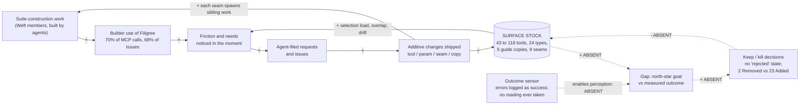
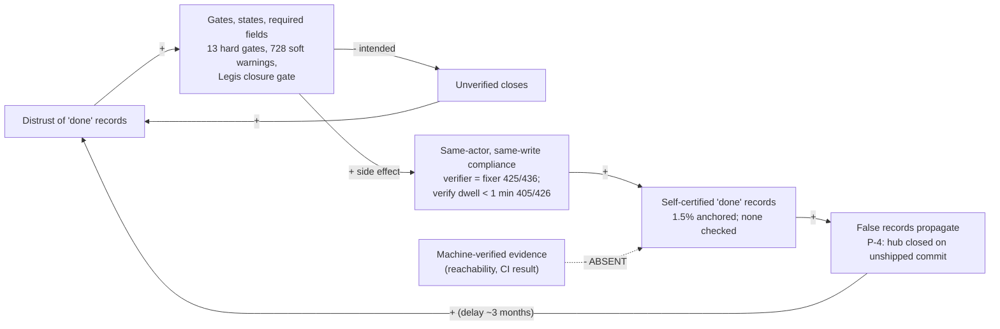
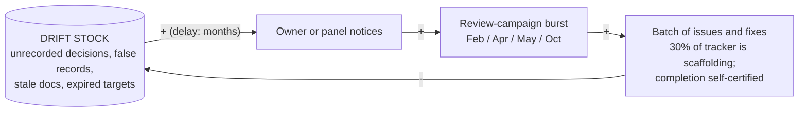

# Leverage analysis: the Filigree 4.0 refresh synthesis

- **Date:** 2026-10-07
- **Reviewer:** leverage analyst (systems thinking, Meadows' 12-level hierarchy). Actor `claude-filigree`.
- **Subject:** [`00-refresh-brief.md`](00-refresh-brief.md) and the seven panel reports beside it.
- **Mode:** read-only. No tracked file edited, no tracker writes, no branch or worktree changes.
- **Question:** what dynamics *produced* the panel's findings, at what level each proposed intervention acts, what the panel missed, and how the recommendations will be resisted or backfire.

---

## 0. The answer

**The panel diagnosed the symptoms correctly and its 4.0 sketch is structurally sound. But it redesigns the structure once and installs nothing that governs how the structure changes afterwards.**

- **Where the brief's interventions sit.** About half of them are at Levels 12–10 (counts and structure), a quarter at Level 6 (visibility) and a fifth at Level 5 (rules). Two are at Level 3 (goals). **None is at Level 4 (self-organization), Level 7 or Level 9.**
- **The forces are untouched.** The forces that produced 118 tools, 24 types, five guide copies and a 9,955-row telemetry warehouse have not changed, so 4.x will regrow the surface.

**The dominant dynamic is a surface ratchet fed by its own builders.**
- **The builders are the users.** Agents building the Weft suite are Filigree's main users: about 70% of logged MCP calls and 68% of all issues fleet-wide come from the Filigree, Loomweave and Wardline repos.
- **Their friction drives the backlog.** Friction they notice in the moment becomes the backlog, and the cheapest fix is always additive.
- **The removal loop has never closed.** No outcome reading has ever been taken and no "no" has ever been recorded. The `feature` type cannot even store a rejection: `deferred` is its only negative exit, and it counts as done.

**My queries on the same event data correct three readings in the brief:**

1. **Gate bypass is not erosion under throughput pressure.**
   - The verify-gate bypass rate fell from 76% (April) to 17% (May), while May was the highest-throughput month.
   - In May, 364 of 386 `verifying → closed` dwells were under a minute.
   - The gate never bound anything. It asked one actor to verify itself, so bypass turned into ritual compliance rather than into verification.
2. **Most force-closes carried evidence; it was self-asserted and unstructured.**
   - 117 of 154 bypassing bug closes cite a commit sha or a test in their close reason.
   - The trust problem is that evidence is self-asserted and cannot be checked, not that it is absent.
3. **D3's "verification plus a commit anchor" would have passed the P-4 false closure.**
   - `79e06d6` *was* a commit anchor, and it was never checked.
   - Only 17 of about 1,139 closes carry an anchor at all.
   - Of those 17, 15 are reachable from `origin/main`, one is the unshipped `79e06d6`, and one is a cross-repo sha.

**Top five interventions by leverage** (§7 has the full re-ranked list):

| Rank | Intervention | Level |
|---|---|---|
| 1 | **A standing outcome loop.** Every surface item carries an outcome reading and a kill-by date, and a release requires a reading and a decision record. Turns D6 from a one-off into a rule. | 5, enabling 4 |
| 2 | **Redefine "done" as integrated and machine-checked.** The commit anchor must be reachable from the integration branch, checked by the server, not just asserted. | 3, enforced at 5 |
| 3 | **D1 = B2, generalised.** No fact without a generator or a reconciler; Filigree holds references, not copies. This makes the vision's existing "composes, does not annex" enforceable. Make Wardline waiver expiry mandatory at the same time. | 5, enacting the existing 2 |
| 4 | **Put integrity signals where decisions happen.** Now / Inbox / "closed without evidence" and a since-last-visit digest for the owner; an actor-aware brief for agents. Design both for an owner whose attention arrives in bursts. | 6 |
| 5 | **Separate the builder signal from the user signal.** Read the north-star on projects that *use* Filigree, not on the suite repos that *build* it. | 6, toward 3 |

**The loop the brief fails to break** is the coupled pair R1 (surface ratchet) and R2 (self-referential demand), with B1, the goal-seeking loop, open at its sensor. The brief prunes the stock once and takes one reading. It adds no standing outflow, so the ratchet resumes after the cut.

---

## 1. Method and provenance

**Read in full:**
- the brief and all seven panel reports;
- `docs/product/`: vision, metrics, PDR-0001 to PDR-0004, current-state;
- the CHANGELOG section structure;
- the release tags.

**New measurements, all read-only:**

| Source | Access | What I computed |
|---|---|---|
| Live tracker | MCP `stats_get`, `metrics_get(days=90)` | Status, type and flow aggregates |
| This tracker's DB | A `.backup` copy in the session scratchpad, queried there | Bypass rate by month; evidence type in bypass close reasons; verify dwell by month; issue creators by actor class; `success_metrics` usage; `close_commit` reachability |
| 14 fleet DBs | `sqlite3 ...?mode=ro&immutable=1` | Issue count and last activity per project |
| Fleet `filigree.log` files | Parsed, excluding this session's calls | Tool mix for suite vs non-suite projects; orientation vs list usage; lease-tool usage |
| `git` | Read-only | Tool count and Python LOC at each of 14 release tags; agent co-authorship; monthly commit cadence; review-campaign document dates |
| Wardline source | One grep | Waiver expiry and owner semantics; scan-artifact retention |

**Provenance rules applied:**
- **Same sources, new cuts.** My numbers are new *cuts* of the sources the panel already used: the same DBs and the same logs. They are **not** independent confirmations of reviewer counts. Where I recomputed a reviewer number, it matched: 491 real bug closes, 154 bypassing, a 31% rate.
- **`origin/main`, not `main`.** The local `main` ref is stale: it sits at `80050fb`, before the 3.3.0 merge `8771fb3`. Reachability was computed against `origin/main`. Against local `main`, 13 valid 3.3.0 anchors falsely read as "not on main". This is a small live demonstration of why a reachability check must fetch and name its integration ref.
- **Side effects of this review:**
  - My read-only MCP calls appended `tool_call` lines to `.weft/filigree/filigree.log`. I excluded them from the tallies.
  - The ephemeral dashboard's pid/port files carry a 12:26 timestamp, consistent with the `PreToolUse` ensure-dashboard hook firing on my first MCP call.
  - No tracker writes and no tracked-file changes.

---

## 2. System map: the dynamics that produced the findings

### 2.1 Stocks

| Stock | Reading (2026-10-07) | Inflow | Outflow | State |
|---|---|---|---|---|
| **Agent surface:** MCP tools | 43 (v1.0.0) → 53 → 58 → 71 → **109 (v2.0.0)** → 114 → **118 (v3.0.0 to v3.3.0)**. Never decreased across 14 tags | Additive fixes and features | **None.** The CHANGELOG has 23 "Added" sections against 2 "Removed" (one removed a warning, one a registration path) | Monotonic. LOC 9.6k → 66.7k (×7) |
| Issue types and packs | 24 types / 9 packs; 13 types never instantiated | Pack additions | None. The planning-pack deprecation draft has been frozen since 2026-05-17 | Static, unused |
| **Findings** (this tracker) | 9,973 rows, 9,955 of them telemetry; ~25k fleet-wide | ~6k engine rows upserted per scan, plus fingerprint churn | Three outflows, all failing for this population (M-3) | Undrainable by construction |
| **"Done" records** | 1,139 done here | Closes | — | Self-certified. Verifier = fixer in 425/436; 1.5% carry an anchor; no anchor is ever checked |
| False or stale records | P-4 closures against an unshipped commit; 3.3.0 milestone still `planning`; `current-state.md` dated 2026-07-07 | Unchecked closes; releases | One-off reconciliation campaigns | Accumulating; ~3 months uncorrected |
| Copies of "how to use Filigree" | 5 (instructions, skill, MCP prompt, `workflow_guide_get`, `docs/agent-integration.md`), plus CLAUDE.md blocks and root `ROADMAP.md` | Each feature or behaviour change | Hand edits to whichever copy a reviewer notices | Drifting; REGRESSED findings recur |
| **Unrecorded decisions** | 5 releases since the last PDR (3.0.0 to 3.3.0); 0 PDRs since; all 4 PDRs dated 2026-06-16 | Decisions made in-session | A PDR (never written) | Growing |
| Ready queue | 43 ready, 12 unstartable | Issue creation | Claims and closes | Polluted (containers, unapproved items, the `Future` seed) |
| Claims and leases | Lease 48 h against claim→done under 10 min in 355/580 | Claims | Release, close or reclaim. Fleet-wide: heartbeat 3, reclaim 1, `release_my_claims` 0 | Recovery loop inert |
| Fleet version skew | `INSTALL_VERSION` 17–29; legacy stores at schema 8 | Majors: three breaks in about five months | Migration (manual) | Growing |
| **Owner attention** (a constrained flow, not a stock) | Commits per month: 386 / 210 / 149 / 324 / 245 / **9 / 3** / 45 (Feb to Sep). Review campaigns in Feb, Apr, May and Oct. Authority grant review 4 cycles overdue | — | — | Arrives in bursts, months apart |
| Wardline waivers / baselines (the B2 verdict store) | **0 files** in all 5 projects that have `.weft/wardline/` | Waivers written to pass the CI gate | Optional expiry (`expires: date \| None = None`, `core/waivers.py:37`); "No governance" (`:10`) | Empty today; no outflow by default once it fills |

### 2.2 Loops

**R1: the surface ratchet** (reinforcing)
- **The loop:** friction noticed → agent-filed request → additive change, the cheapest non-breaking fix inside a minor → surface stock → more friction: tool-selection misranking (LX-06), concept overlap (LX-13), more copies to drift (LX-15) → more requests.
- **What is missing:** any outflow (see B1).

**R2: self-referential demand** (reinforcing)
- **The loop:** suite-construction work → builder use of Filigree → builder needs (findings mirror, file registry, entity associations, governance gates, the Warpline seam) → federation and periphery surface → each seam spawns more sibling work (contract tests, conformance oracles, drift lanes, sibling changes) → more suite-construction work.
- **Evidence:**
  - 3,835 of 5,485 logged MCP calls (70%) and 2,132 of about 3,129 issues (68%) come from the three suite repos.
  - All **22** tools used only in suite repos are periphery tools: `get_file`, `list_files`, `dismiss_finding`, `update_finding`, `get_file_annotations`, `list_entity_associations`, `list_reconciliation_debt`, and others.
  - Non-suite projects called `list_findings` 4 times in total.
  - Of the 1,187 issues created in this tracker, 6 trace to an identifiable human actor.
  - 960 of 1,371 commits (70%) carry a `Co-Authored-By: Claude` trailer.
  - All four PDRs are authored by `claude-filigree`.
  - **Agents define the work, do it, verify it, accept it, and author the product decisions about it.**

**B1: the intended goal-seeking loop** (balancing, **open**)
- **The loop:** north-star goal (loop completion without dead-ends) compared with the measured outcome → gap → keep/kill and reprioritisation → less off-goal surface.
- **Where it is broken:**
  - **At the sensor.** `tool_call` logs error envelopes as INFO success; schema rejections are not logged at all; HTTP and CLI calls are not logged (P-2).
  - **At the actor.** Even dated targets (`metrics.md`, all due 2026-09-30) expired with no alarm and no reading.
- **The structural consequence:** `feature` has no rejection state. A balancing loop that cannot write its output cannot run.
- **Result:** with B1 open, R1 and R2 decide what gets built. PDR-0002 named agent DX as the Now bet. 3.1 to 3.3 shipped about 36 federation commits against 9 agent-facing ones (P-1), with no PDR in between.

**R3: ritual gates** (Fixes that Fail, see §3)
- **The intended balancing loop:** distrust of "done" → more gates, states and required fields → fewer unverified closes.
- **The side effect:**
  - The gates can be satisfied by the gated actor in the same write. Verifier = fixer in 425/436; verify dwell is under 1 minute in 405/426; 728 soft warnings were ignored.
  - That produces ritual compliance or force bypass → self-certified records → false records that propagate across products (P-4) → more distrust → more gates. The Legis closure gate was the largest such addition, and it is now a fail-closed trap.

**R4: orientation decay** (reinforcing)
- **The loop:** a noisy orientation signal (telemetry counted as "actionable", unstartable items in READY, a stale critical path) → agents route around it → nobody depends on the snapshot, so its defects are not felt → fixes land where they are tested, not where they are read → more noise.
- **Evidence of route-around:** fleet-wide `get_ready` 36 and `start_next_work` 6, against `list_issues` 209, of which 151 used `no_limit=true`.
- **Evidence that fixes landed in the wrong place:**
  - `filigree-406e6b7ee0` fixed `startable` in the `work_ready` JSON but not in the snapshot agents actually read (LX-02).
  - FIL-1 fixed the banner's wording but still counts telemetry as "actionable" (LX-01).

**R5: copies without a reconciler** (drift)
- **The pattern:** a fact copied into N places with no generator or reconciliation check drifts at a rate proportional to N times the change rate. Review campaigns fix one copy at a time.
- **The same structure appears at every scale:**
  - *Code facts:* the findings mirror, file registry and annotation anchors (all "D!" in the boundaries report).
  - *Agent guidance:* the five copies.
  - *Contracts:* the hub restating member facts; `contracts.md` against the live auth scope (F15).
  - *Product state:* `current-state.md`, the second roadmap, README surface counts.
  - *Instructions:* CLAUDE.md naming archived tools.
- **Evidence:** REGRESSED findings in this panel (LX-08, LX-14, LX-16, MCP F9, F19) are the signature of a fix applied to a copy, not to the source.

**B3: episodic correction** (balancing, **with a long delay**, so it oscillates)
- **The loop:** the drift stock accumulates → after a delay of months the owner or a review panel notices → a campaign burst (Feb design review; Apr 18 and 24; eight docs in May 6–17; Oct 7) → large batches of issues and fixes → drift falls → attention leaves → drift accumulates.
- **What the bursts leave behind:**
  - Campaigns over-produce scaffolding: 30% of this tracker is review and scratch material (BP-06).
  - They self-certify their own completion. The 05-14 gap analysis marked every row "Done" (MCP critique, Disagreement 1).
- **This refresh panel is the latest burst.**

**B4: claim recovery** (balancing, **inert**)
- **The loop:** stranded claim → lease expiry → `stale` → reclaim.
- **Why it is inert:** a 48 h buffer against sub-10-minute work means a stranded claim hides for two days, and expired claims never re-enter `ready` (BP-09).
- **Usage:** heartbeat 3 calls, reclaim 1, `release_my_claims` 0 fleet-wide.

**Diagram 1: the surface ratchet and the open goal loop.** Dashed edges are links that do not exist today.



**Loop polarities:**
- **R1** = FR→RQ→AD→SS→FR. No negative links, so it is reinforcing.
- **R2** = SC→BU→FR→RQ→AD→SC. No negative links, so it is reinforcing.
- **B1** = SS→GAP→KK→SS. One negative link, so it is balancing. It is absent today.

**Diagram 2: closure integrity (Fixes that Fail).**



**Loop polarities:**
- **Intended B loop** = DT→GT→UV→DT. One negative link, so it is balancing.
- **Side-effect R loop** = DT→GT→RC→SR→FP→DT. No negative links, so it is reinforcing.

**Diagram 3: episodic correction (balancing with a long delay).**



### 2.3 Delays

| Delay | Measured | Consequence |
|---|---|---|
| Metric target → reading | Infinite. Targets expired 2026-09-30 unread | B1 never closes |
| Decision → record (PDR) | 5 releases, 0 PDRs; workspace untouched since 2026-07-07 | Strategy drift cannot be told from deliberate pivots (P-6) |
| Authority-grant review | Monthly cadence, last done 2026-06-16, so about 4 cycles late | The grant governing a kill-heavy major is stale (P-13) |
| Close → integration check | No check exists. P-4 has stood about 3 months, and it propagated to the hub | False records outlive the work |
| Release → milestone closure | 35+ days and counting (3.3.0 still `planning`) | Containers do not roll up (BP-03) |
| Kill proposal → decision | Planning-pack deprecation: 2026-05-17 → none (~143 days) | "No" is never recorded |
| Federation retirement notice | Policy 12 months; actual 0 (`loom`, F3) | The freeze promise lost credibility |
| Release interval vs fleet adoption | Three majors in about five months, against `INSTALL_VERSION` 17–29 and schema-8 stores | Version skew grows. Any "no shims" break lands on a mixed fleet |
| Queue vs work (90 days) | Average lead time 382 h against average cycle time 0.5 h | Waiting, not doing, dominates. The cycle figure is partly bookkeeping (BP-12) |
| Claim lease vs work | 48 h against a sub-10-minute median | Strandings hide for two days; the Now board would show stale truth |

### 2.4 The seven candidate dynamics, tested

| Candidate | Verdict | Decisive evidence |
|---|---|---|
| Surface growth without outcome readings | **Supported, strengthened** | Tool count never decreased across 14 tags. 23 Added vs 2 Removed sections. `feature` has no rejection state (`templates_data.py:117-133`). 21 of 33 epics carry `success_metrics`, but 20 are Bug-tree folders and the one real epic defines success as output ("all P1 findings resolved"). |
| Findings stock with no outflow | **Supported.** M-3's Shifting the Burden holds (§3) | 3 links in 9,973 rows. The three outflows fail. Option A would make the symptomatic path cheaper. |
| Force-close escape lane becoming the normal lane | **Reframed.** Not erosion; a hollow gate | Bypass 76% → 17% (Apr → May) as throughput rose. April's bypasses cluster on 17–18 April under anonymous actors (`mcp`, `cli`, model-name variants). 117 of 154 bypasses carry prose evidence; only 22 carry none. When bypass fell, ritual rose: 364/386 May dwells under 1 minute. |
| Federation contract drift | **Supported** as "copies without a reconciler" (R5) plus rule breaches with no record | The hub restated member facts. `loom` was retired with no ADR. `contracts.md` contradicts the live auth scope. Two seams have no goldens (F17). No archetype fits cleanly. |
| Documentation and instruction drift | **Supported:** Fixes that Fail via copy edits | REGRESSED findings LX-08, LX-14, LX-16, F9, F19. `filigree-b48cd07e68` pinned tool counts, not behaviour. |
| Strategy drift without a PDR while the workspace went stale | **Supported, but the mechanism is delay, not goal erosion** | The PDR-0002 goal was never lowered. It lost causal power because B1 had no sensor and the owner loop (B3) runs in bursts. All four PDRs date from one day. |
| Agent-as-builder-and-user loop | **Supported, quantified** (R2) | 70% of calls, 68% of issues, and all 22 suite-only tools are periphery. 6 human-created issues of 1,187. 70% of commits agent co-authored. **The refresh panel itself (seven agents reviewing agent-built software from logs dominated by suite construction, proposing a rebuild for agents to execute) is inside this loop.** |

One further dynamic surfaced in the data:

- **The tracker is partly a retrospective ledger.**
  - Fleet-wide, `close_issue` was called 633 times, against 391 tracker-visible starts (`start_work` 373, `claim_issue` 12, `start_next_work` 6).
  - Roughly 240 closes have no tracker-visible start. Some are legitimate discards or batch closes; I did not decompose them.
- **This bounds every intervention on the close edge.** A completion gate governs the bookkeeping of work done elsewhere, so it must check something the agent cannot simply type.

---

## 3. Archetype matches

| Archetype | Where it fits | Evidence | Fit | Intervention it implies |
|---|---|---|---|---|
| **Shifting the Burden** | **Findings.** This builds on M-3 rather than repeating it. | Two additions to M-3. **(a) Addiction:** each symptomatic tool (dossier, promote-and-attach, clean-stale, suppression filters, reconciliation debt) raised the sunk cost against the fundamental fix, and the brief must now gate B2 on deprecating "used" features those tools created. **(b) Option A makes the quick fix cheaper:** `kind`, a disposition policy and retention-in-ingest keep the mirror alive at lower cost. The archetype's first prohibition is "do not make the quick fix easier". | **High** | Level 5: who may hold the stock (B2). Reject A on archetype grounds, not just on effort. |
| Shifting the Burden | **Catalog discoverability** | The 06-02 plan chose tier tags over consolidation (MCP critique, Disagreement 3). The tiers are inert: the suffix is invisible to the ranker, and "claim and start" ranks `work_start` 5th (LX-06). Tiering relieved the pressure, so consolidation never happened. 3.0 then spent a whole breaking major renaming all 118 tools rather than reducing them. | **High** | Level 5 budget rule (X2), not re-tiering. |
| Shifting the Burden | **Identity** | 3.2.0 removed the `ACTOR_MISMATCH` warnings because they were false positives. That silenced the alarm instead of binding identity, the fundamental fix, which has been proposed since May (`filigree-c2009921cf`, untouched about five months). | **Moderate-High** | Level 10 identity (D4), coupled with sessions. |
| **Fixes that Fail** | **Gates** (Diagram 2) | BP-02 states the loop itself. 13 hard gates, 728 ignored soft warnings, and the Legis gate added for trust became an availability trap. The bypass-to-ritual conversion shows the side effect directly. | **High** | Level 3: change what "done" means; Level 6: make evidence quality visible. Not more gates. |
| Fixes that Fail | **Copies** (R5) and **one-off reconciliations** | REGRESSED tags; do-now #9 and #11 as written | **High** | Level 10: single source (generation), plus Level 8 fixture tests |
| **Drifting / Eroding Goals** | **Tested and largely rejected for gates.** | The diagnostic is a standard lowered over time. The verify standard was never lowered. Bypass *fell*, and the standard was hollow from its first day: the first `verifying` event was 2026-04-17, with one actor as both fixer and verifier. A Level 5 rule was imposed on a Level 10 structure that had one actor, so the rule asked for information the structure could not produce. | **Low** | — |
| Drifting Goals | **Partial instances** | `metrics.md` targets were not lowered; they were abandoned, which is "a goal without feedback". `start_work(advance=true)` (2.1.0, 2026-05-30) codified the ritual walk, but the sub-minute dwell predates it, so `advance` ratified existing behaviour rather than causing it. | Low-Moderate | Level 6: make the gap visible (X4) |
| **Limits to Growth** | **Tool-selection cognitive load** | LX-06 misranking at 118 tools. The plateau at 118 since 3.0 coincides with the activity collapse (9 and 3 commits in Jul and Aug), so the plateau cannot be attributed to the limit. | Low-Moderate | Remove the constraint by shrinking (structure), but see R1 regrowth |
| **Tragedy of the Commons** | **The agent's attention and context window** | The banner, READY list, critical path and analyzer line are each locally reasonable, and together they train agents to ignore the snapshot (R4). 118 schemas cost about 25K tokens when eager-loaded. R3's proposed `notices` channel is a new commons every feature will want to write into. | **Moderate** (strongest as a forward risk) | Level 5 quota (X2); Level 6 make each feature's share visible |
| **Balancing loop with delay** (Senge's oscillation archetype; outside this pack's ten) | **Episodic correction** (B3) | Bursty commits and review campaigns; four PDRs on one day; the workspace frozen since 07-07 | **Moderate-High** | Level 9: shorten the delay with per-release rules rather than monthly human reviews (X4) |
| **Success to the Successful** | Federation vs agent DX | Federation won the 3.x releases, but the evidence shows owner-set priorities plus "work begets work" (R2), not resources allocated by prior success. | **Does not fit** | — |
| **Escalation / Accidental Adversaries** | Four acceptance stores across members | Each member built its own store to compensate for missing synchronisation. There is no evidence of one party's fix harming another in a loop. | **Does not fit.** The structure is R5 (copies without a reconciler), a stock-flow defect rather than an archetype | — |
| **Growth and Underinvestment** | Claim and lease machinery, orientation | Plausible (the surface grew while the recovery loop stayed inert), but there is no "we didn't need it after all" signal | **Does not fit** on the evidence | — |
| *Unnamed:* a reinforcing loop with no external balancing signal | **Builder as user** (R2) | §2.4 | **Structure supported; no canonical archetype** | Level 6 → 3: introduce an external reference population (X5). I do not force a name onto it. |

---

## 4. Where each intervention in the brief sits

"Tweak?" asks whether the item is a Level 12–10 change presented as if it fixed the dynamic. Loop names refer to §2.2.

| # | Intervention (brief section) | Level | Tweak dressed as fix? | Acts on | Verdict |
|---|---|---|---|---|---|
| G1 | §1 "Shrink Filigree to work state" | **3** (system purpose) | No | R1, R2 | The brief's strongest goal-level move. It needs a rule to stay true (X1, X7). |
| G2 | §1 "Make closure honest" | 3 as a goal; implemented at 5 and 12 | Partly: the mechanism is a field | R3 | Right goal, weak mechanism (see D3d). |
| G3 | §1 "Make the contract safe for agents" | 10 | No | Defect class | Right |
| D1-A | Option A: `kind`, disposition policy, retention in ingest | 8/10, **on the symptomatic branch** | **Yes.** It makes the quick fix cheaper | Shifting the Burden (strengthens it) | Reject on archetype grounds |
| D1-B2 | Producers own facts; Filigree holds references | **5** (who may hold a stock) + 10; enacts the existing L2 vision line | No | Findings; R5 | Highest-leverage *ruling* in the brief. Generalise it (X7). |
| D1-S0 | Stage 0: defect-only emit, stable fingerprints, refuse `<engine>` | 10 (cut the inflow) + 12 (fingerprint inputs) | A tactical tweak, used correctly | Findings inflow | Right as the first tactical step. Cross-product, so not a P3. |
| D1-S0b | Bulk-mark existing telemetry `fixed` (boundaries Stage 0 script) | 12 (one-off stock correction) | **Yes, and harmful** | — | Marking it `fixed` falsifies resolution, the same pattern as BP-01: "fixed" goes from 4 rows to about 9,959. Use a non-`fixed` disposition, or export and drop. |
| D2 | Archived members: fold their ideas in rather than rebuild | 10 (suite topology); 3 for the suite's purpose | No | R2 | Correctly non-blocking for Filigree |
| D3a | 24 → 6 types; 9 packs → 1 built-in | 12 (counts) + 10 (one lifecycle) | The counts are; one lifecycle is not | R1 (selection load) | The structural part is right; the counts are parameters |
| D3b | Retire force-close; `discard` as a forward edge with a resolution | **5** | No | R3 | Right, but expect route-around (§6) |
| D3c | Resolution enum | **6** (makes discard visible) | No | R3; B1 measurement | Right, and a precondition for honest throughput |
| D3d | Completion evidence = verification + commit anchor | **12 as written** (adds a field the same actor fills) | **Yes** | R3 | Would have passed P-4. Raise to Level 3/5 (X3). |
| D3e | Containers gated on children; blockedness inherits | **8** | No | Planning roll-up | Right; watch the "unscheduled" dumping ground (§6) |
| D4 | Launch-bound identity; refuse unidentified writes; session-keyed claims | 10, enabling 6 | No | Attribution, claim exclusion | Right, but "low controversy" understates the coupling risk (§6) |
| D5a | Retroactive `loom` retirement ADR | 6 (record the truth) + 5 (restore the freeze rule's credibility) | No | Federation trust | Cheap; do it first within D5 |
| D5b | Successor HTTP generation | 10 | No | — | Right mechanism |
| D6 | Fix instrumentation, take one baseline, write the PRD with a reversal trigger | 6 one-shot + 3 (the PRD sets the goal) | **Becomes a tweak if it is one-shot.** The 2026-06-16 workspace was exactly a one-shot. | **B1** | Under-ranked (6th) and under-specified. It must be a standing loop (X1, X4). |
| D7a | Dashboard Now / Inbox / Activity / Plan / Issues | **6** | No | B1 for the overseer; R4 | Under-ranked (last). It already contains the gate-bypass-to-overseer flow (UX J4) the task asked about. Credit the UX review. |
| D7b | Kill drag-and-drop, flow cards, tour, Save Preset | 5 (remove a rule-bypassing affordance) / 6 (remove misleading information) | No | R3 | Right |
| N1 | Undo: `expected_event_id` plus holder check | 5 (micro rule) | Defect repair | Retry amplification | Right, tactical |
| N2 | `work_release` holder-checked; fix the skill recipe | 5 micro + 6 | Defect repair | Claim integrity | Right, tactical |
| N3 | next-claim retry idempotency | 10 micro | Defect repair | Stranded claims | Right |
| N4 | Legis: warn, don't wedge | 10 (remove a dead coupling) | No | Availability | Right; a live trap |
| N5 | Federation token file vs env | 12 | Defect | Auth | Right |
| N7 | Session banner and READY | **6** | No | **R4** | Under-ranked: every session reads it |
| N8 | Scan results `failed[]` populated | 6 (feedback to the producer) | No | The producer's balancing loop | Right |
| N9 | Reconcile tracker; close the 3.3.0 milestone; rewrite `current-state.md` | 12 (one-off stock correction) | **Yes, unless paired with a rule** | R3, B3 | Recurs without X3/X4 |
| N10 | Log error responses as errors | **6** (the sensor for B1) | No | **B1** | The most important do-now item, listed 10th |
| N11 | CLAUDE.md names Legis and Warpline as live | 6 (one copy) | **Yes, as a one-off** | R5 | Recurs without generation (X7) |
| C1 | One error envelope with `retryable` | 10 + 6 | No | The agent's retry loop | Right |
| C2 | Retry safety and a call-twice test per tool | 10 + **8** (a balancing loop in CI) | No | Retry amplification | Right. The test is the durable part. |
| C3 | One bounding rule; no `no_limit` | 5 (no bypass) + 12 (limit 25) | The limit value is | R4 | Sequence it after the orientation fix (§6) |
| C4 | Actor-aware orientation | **6** | No | R4 | Right; high leverage for its cost |
| C5 | Smaller surface: 118 → 76 / 52; profiles; resources | **12** (counts) + 10 (resources, profiles) | **Yes. The headline target is a count.** | R1 | Regrows without X1/X2. Merges move complexity into parameters. |
| C6 | One generated agent guide plus fixture tests | **10 + 8** | No | **R5** | A genuine structural fix to a drift loop |
| C7 | `weft-contracts` plus vendored goldens | 10 + 8 + 5 (the seam owner writes the spec) | No | R5 at federation scale | Right. RSK-3 notes it can drift the way the hub did. |
| C8 | "What must survive" list | 5 (constraint) | No | — | Right; protects the balancing structures that work |
| Q1 | §5 stage gates on observable criteria, not dates | 5 + 8 | No | — | Right in form. But **every gate is a build or contract gate, and the sequence ends at "Cut"**: the build trap reproduced at plan level (X10). |

**Distribution of primary levels** (38 rows; D1-A counted at 10; N6 omitted because it duplicates D1-S0):

| Levels | Rows | Share |
|---|---|---|
| 12–10 | 18 | ~47% |
| 9 | 0 | 0% |
| 8 | 1 | ~3% |
| 7 | 0 | 0% |
| 6 | 9 | ~24% |
| 5 | 8 | ~21% |
| 3 | 2 | ~5% |
| 4, 2, 1 | 0 | 0% |

**Reading the distribution:**
- **The brief is not stuck in parameter-tweaking mode.** B2, force-close retirement, the resolution enum, D7 and orientation are real Level 5–6 moves.
- **But four gaps are structural.** It has nothing at:
  - **Level 9:** no delay is shortened, neither the owner's feedback delay nor the lease;
  - **Level 7:** no virtuous loop is built deliberately;
  - **Level 4:** no rule governs how the surface may evolve;
  - **Level 2:** the paradigm it relies on, "composes, does not annex", already sits in `vision.md` and was drifted from. Restating it without a rule repeats the failure.

---

## 5. High-leverage interventions the panel missed or under-weighted

Each entry gives the level, the mechanism, the loop it breaks or creates, the delay before it shows, and how to tell it is working or failing.

### X1. Surface admission and expiry registry (Level 5, enabling Level 4)

- **Mechanism.** Every MCP tool, CLI verb, HTTP route, type, pack, profile, seam, session-brief line and guide section is declared in **one registry**. Each entry records:
  - the job it serves;
  - its owner;
  - its outcome reading and instrument;
  - a **kill-by date**.

  The catalog, CLI, docs and OpenAPI are generated from that registry, reusing R6 (one source), MCP F20 and HTTP F20.
- **Enforcement.** CI fails when a kill-by date passes without a recorded keep/kill PDR. A new entry needs a declared reading.
- **Data model.** Add a `rejected` / `wont_do` terminal to the feature lifecycle so that a "no" can be stored. BP's resolution enum does this in 4.0.
- **Loop.** Adds the missing outflow to the R1 stock. It creates a standing B1 that does not depend on anyone remembering to look.
- **Delay.** The first expiries arrive about one quarter after 4.0.
- **Working:** at least one recorded kill or "no" per quarter (today: 0 ever); default-profile schema bytes flat or falling across 4.x minors; 100% of entries carry a current reading.
- **Failing:** kill-by dates extended en masse without readings, which means rubber-stamping. Escalate to X2.

### X2. A budget for the agent's attention commons (Level 5, enabling Level 4)

- **Mechanism.** Fix a budget for the default profile (schema plus description bytes) and for the session brief (about 40 lines, per LX R1). Any addition must stay within the budget: one in, one out. Features then compete for a fixed resource, which is the standard remedy for Tragedy of the Commons.
- **Why a budget rather than a count.** C5's targets (76 or 52 tools) are counts, and counts are gamed by merging tools into mode-flagged, array-taking tools. Examples from the catalog proposal itself: `observation_promote(mode: each|merge)` and `annotation_update(status, replacement_id, add_links, remove_links)`. Budget bytes and concepts, not tool names.
- **Loop.** Balances R1 at merge time. It also caps the R3 `notices` channel before it fills (§6).
- **Delay.** Immediate (CI).
- **Working:** the budget is never exceeded; additions arrive with removals; a 20-query ToolSearch golden set (LX information gap 2) holds or improves.
- **Failing:** budget raises filed as "temporary".

### X3. "Done" means integrated and machine-checked (Level 3, enforced at Level 5)

- **Mechanism.**
  - `resolution=completed` requires a commit anchor that **the server** verifies is reachable from the fetched integration ref.
  - Otherwise the item waits as `in_review` with reason `awaiting-integration` (BP-11's state). It is on by default in git repos, not opt-in.
  - Cross-product consumers may cite only `completed` items. That is what would have stopped the hub closing on `79e06d6`.
  - Evidence the agent types (verification text) stays, but is labelled as asserted.
- **Loop.** Breaks the R3 side effect at its root: evidence a third party (git) checks cannot be ritually supplied. It also closes the P-4 path.
- **Delay.** Immediate on each close; the records change within one release.
- **Working:**
  - the share of `completed` closes carrying a reachable anchor goes from 1.5% today to over 90%;
  - zero closes against unreachable commits;
  - the `awaiting-integration` age is visible and small.
- **Failing:** agents anchor to whatever HEAD is, including unmerged work. The reachability check catches exactly this, provided the ref is fetched (§1, stale local `main`).
- **Limit.** It governs only tracker-visible closes. About 240 fleet closes had no tracker-visible start (§2.4).

### X4. Integrity signals in the path of action, and a release that depends on them (Level 6 feeding a Level 5 rule; shortens the Level 9 delay)

- **Owner side.** A since-last-visit digest at the top of the dashboard (D7 "Now" plus UX J4/J5) and as a CLI digest. It shows:
  - discard and bypass rate by actor and resolution;
  - the self-verified share;
  - closes without a reachable anchor;
  - containers open after release;
  - expired metric targets;
  - the age of the latest PDR and of the grant review.
- **Release side.** Tagging fails, through a CI job or `filigree` release precondition, when:
  - a release container has non-done children;
  - metric targets have expired without a reading;
  - there has been no PDR since the last release;
  - the release contains closes without reachable anchors.
- **Why this shape.**
  - **The owner's attention arrives in bursts** (§2.1): four PDRs on one day, then nothing for four months.
  - Interventions that need continuous human attention will fail: monthly grant reviews, a human-gated `in_review` queue, a growing Inbox.
  - Release is already an owner gate under the grant, so hang the checks there. Make each burst visit as informative as possible.
- **Loop.** Shortens B3's delay from months to one release interval, and gives B1 a trigger.
- **Working:** PDR count ≥ release count; zero releases with open container children; every release carries a dated metric reading.
- **Failing:** the gate is overridden at every release. Count the overrides.

### X5. Separate the builder signal from the user signal (Level 6, toward Level 3)

- **Mechanism.**
  - Tag each registered project `suite-construction` or `product-use`.
  - Compute the north-star, usage and dead-end rate per population.
  - Weight keep/kill and default-profile decisions to the product-use population. Today that is hamlet, aurora, simic, errorworks, keisei, skillpacks and others: about 1,650 calls, 30% of the logged total.
  - Label dogfood-friction issues `source:dogfood`. They need a product-use reading before they may add surface.
  - Run review and scratch campaigns in a scratch project, not the production tracker (BP-06).
- **Loop.** Gives R2 an external balancing signal. The stated 4.0 target is "fleet plus external agent users", and the suite-construction population is a biased sample of both.
- **Delay.** One reading cycle (about four weeks).
- **Working:** new surface is justified by product-use readings; the non-suite dead-end rate falls.
- **Failing:** the product-use population is too small to read (a real risk at n=1 operator). Then say so in the PDR and accept the decision as UNKNOWN rather than ACCEPT.

### X6. Paradigm: agent-first means designed around agent failure modes, not agent requests (Level 2)

- **Mechanism.** Every proposal names either the agent failure mode it contains or the outcome it moves. Failure modes include: retry duplication, hallucinated or self-certified completion, context exhaustion, identity collision, stale prose. Proposals that name neither go to `parked`.
- **Why.** The evidence shows "agent-first" has meant "agents asked for it". That produced 118 tools while the failure modes went unaddressed: the MCP critique is almost entirely about failure modes (retries, unbounded reads, non-holder release, undo walk-back).
- **The companion paradigm.** "Filigree composes, it does not annex" **already exists** in `vision.md` and had no causal power. That is the "high-leverage intervention without foundation" failure. Make it operative with a review test: *"can Filigree keep this fact correct without a peer and without a code change?"* If not, it is a reference, not a stock (boundaries §1).
- **Delay.** Slow: two to three proposal cycles.
- **Working:** proposals cite a failure mode or a reading; the parked-proposal count is visible.

### X7. Every derived copy has a generator or a reconciler (Level 5 design rule)

- **Mechanism.** State this once as a rule, checked at review. It covers:
  - the findings mirror, file registry and annotation anchors (B2);
  - the five guide copies (R6);
  - contracts (`weft-contracts`);
  - CLAUDE.md managed blocks that name tools;
  - `current-state.md` and root `ROADMAP.md`;
  - README surface counts;
  - `metrics.md` readings.
- **Why it matters.** The brief applies the rule piecemeal in three lanes, so R5 will recur in the lanes it did not visit.
- **Loop.** Breaks R5 at every scale.
- **Delay.** Per change.
- **Working:** zero REGRESSED findings in the next review; exactly one hand-maintained source per behavioural claim.

### X8. Size the claim buffer to the work (Level 11, with Level 9 effect); under-weighted rather than missed

- **Mechanism.** Adopt BP-09:
  - a default lease of about 2 h;
  - an implicit heartbeat on any write by the holder;
  - expired claims listed as `reclaimable` in `ready`;
  - `release` returns the item to its last open state.
- **Why it matters.** It appears in neither D4 nor the do-now list. The D7 "Now" board is meaningless while a dead agent looks alive for 48 h.
- **Loop.** Revives B4.
- **Working:** heartbeat and reclaim counts become non-trivial; no claim stays stranded longer than the lease.

### X9. Tie the release cadence to fleet adoption (Level 9 / Level 5)

- **Mechanism.** No new major until the previous major's migration is automatic and a stated share of active projects runs it. Take a fleet version census as a Stage 2 exit criterion.
- **Why.** With "no shims" and seam retirements in 4.0, skew (`INSTALL_VERSION` 17–29, schema 8) turns into breakage. The brief's additive last-3.x minor helps, but it gates nothing on adoption.
- **Working:** the version spread across active projects narrows before the cut.

### X10. Add a "Stage 5: read and decide" to the sequencing (Level 5)

- **Mechanism.** Four to six weeks after the 4.0 cut:
  - re-read the baseline on the product-use population;
  - record ACCEPT / REJECT / UNKNOWN in a PDR;
  - apply a reversal trigger that has an "abandoned or dependency-dead" branch (P-7, P-8).
- **Why.** The brief's §5 ends at "Cut", which is where 3.3.0 ended: its milestone is still `planning`.
- **Working:** the PDR exists on time.

---

## 6. Policy resistance and unintended consequences

**How resistance shows up in an agent fleet.** Agents do not argue with a rule. They satisfy it in the same write, or they route around it with another call. That is invisible unless it is measured. **Every rule below therefore needs a paired measurement of *how* it is being satisfied.**

| # | Recommendation | Predicted resistance or side effect | Evidence | Mitigation | Leading indicator |
|---|---|---|---|---|---|
| 1 | **Shrink the catalog (C5)** | **Regrowth:** R1 and R2 are intact, and additive fixes stay the cheapest inside a minor. **Parameter inflation:** merges move complexity into mode flags and arrays. **Holding pens:** opt-in `admin`/`federation` profiles and "optional installable packs" hide surface from usage logs, so it is never called and never killed, yet it still carries migration and test cost. | Monotonic tool count across 14 tags; the catalog proposal's merged signatures | X1, X2. Opt-in profiles and packs live out of tree with their own owner and kill-by date, or carry the same registry entry. | Schema bytes per 4.x minor; count of profile-only tools |
| 2 | **Retire force-close (D3b)** | Agents route around the evidence gate: **(a)** the `discard` lane becomes the new escape (`obsolete`/`wont_do` to avoid evidence); **(b)** boilerplate evidence in the same write; **(c)** WIP left open (the lease loop is inert); **(d)** the container close gate leads to children dumped into an "unscheduled" epic, which BP §5.6 itself proposes as the migration target for 3.3.0's 21 open children, creating a new stock with no outflow; **(e)** work done outside the tracker and closed retrospectively. | Bypass converted to ritual when it fell (May: 17% bypass, 94% of dwells under 1 minute). Closes exceed tracker-visible starts by about 240. | X3 (a check the agent cannot type); discard rate by actor and resolution in the owner digest (X4); an "unscheduled" container with an aging review. **Do not use "gate-bypass rate = 0 by construction" (BP §5.5) as a success metric:** it cannot fall, so it detects nothing. | Discard rate by actor; share of `completed` with a reachable anchor; unscheduled-container size |
| 3 | **D3 completion evidence as written** | Ritual compliance identical to today's verify gate. Passes P-4. | 425/436 self-verified; `79e06d6` was an anchor | X3 | — |
| 4 | **B2: producers own findings (D1)** | **(a) The escape lane moves into Wardline.** A waiver is the only acceptance the CI gate reads, so under B2 it becomes the cheapest way to pass `--fail-on ERROR`. Expiry is optional (`waivers.py:37`) and there is no owner or approver ("No governance", `:10`): a stock with no outflow once it fills. It is empty today: no verdict YAML in any of the 5 projects. **(b)** The triage inbox of promoted bugs becomes the new findings stock if defect volume rises on codebases with declared trust boundaries (unmeasured; boundaries gap 5). **(c)** References in `state: unknown` accumulate on open issues if S-3 is not sent (surfaced by design, RSK-2). **(d)** The ~25k-row archive export is a dead stock. **(e)** The "promotes per 100 defects" health metric has no owner, which is the confident-empty failure (RSK-1). | `wardline/src/wardline/core/waivers.py:10,37`. Scan artifacts *are* pruned (`core/artifacts.py:56,61`), so run reports are not a new stock. | Make waiver expiry mandatory and report waiver count and age wherever defects are reported. This is cross-product wire work: ship it with S-2/S-3, not as a deferred P3. Add an aging rule to `triage`. Give the archive an owner and a deletion date. Make Wardline print "N defects, M promoted". | Waiver count and age; promotes per defect; triage age |
| 5 | **Launch-bound identity (D4)** | **(a)** Every session, subagent and worktree launched from the same MCP config shares one actor. Unless session keying ships in the same change, the claim CAS treats them as one holder, and BP-10's "same name, not excluded" becomes universal. The cheap half (a launch flag) is likely to ship while the structural half (sessions) defers again: ADR-011 deferred it once, and `filigree-c2009921cf` has been untouched for about five months. **(b)** Refusing anonymous writes leads external agents to pass arbitrary strings to get through, so the noise moves into the actor field. | BP-10; 54 actor variants; `mcp`/`cli` defaults on 35% of status changes | Ship identity and session together, or not at all. The server **mints** a session id per connection and attributes writes to it, rather than refusing them; the actor label is descriptive. | Distinct sessions per actor; claim conflicts between sessions of the same actor |
| 6 | **North-star instrumentation (D6)** | **Goodhart.** If dead-ends are counted from error envelopes, there is pressure to turn errors into warnings or success-shaped no-ops, so the rate falls without fewer dead-ends. | 728 soft warnings today; `{status:"empty"}` and `{undone:false}` sentinels (MCP F23) | Define a dead-end to include warnings, no-op sentinels, retries within N seconds, and fallback to `list_issues` with no limit. Read it on the product-use population (X5). | Ratio of warnings to errors over time |
| 7 | **Remove `no_limit` (C3)** before orientation is fixed | Agents already route around `work_ready` (36 calls) through `list_issues no_limit` (151 calls). Remove the bypass first and they page through cursors (more calls, more tokens) or fall back to search. | Fleet logs | Sequence N7 and C4 (an honest snapshot and READY) **before** or with the bounding rule | `work_next`/`work_ready` share of orientation calls |
| 8 | **`notices` channel (LX R3)** | It becomes the next commons, with every feature pushing into it | The banner already did this (LX-01) | X2 budget; three-item cap; measure the ignore rate | Notices per response |
| 9 | **Dashboard Inbox (D7)** | With bursty owner attention, the Inbox becomes the next stock with no outflow. Unattended human-gated items stall agents. | §2.1 owner cadence | Aging defaults: undecided items fall to a safe state (`parked`, not `approved`). Exception-only entries. Prefer machine checks (X3) to `human` gates. | Inbox age; share decided per visit |
| 10 | **One-off reconciliations (N9, N11)** | Fixes that Fail: they recur | REGRESSED findings | Pair with X3 and X4 (anchors and milestones) and X7 (generation) | Recurrence at the next review |
| 11 | **Stage 0 bulk-mark as `fixed`** | Falsifies resolution and inflates any "findings fixed" metric about 2,500-fold | BP-01 pattern | A distinct disposition (`not_work`) or export and drop | — |
| 12 | **"Rebuild everything" (owner direction)** | Reproduces the 3.x inventory by default. A major chosen before a problem (P-12) would be the fourth break in about eight months, with agent-instruction churn in every project. | P-12; fleet skew | Start the rebuild from the kill/keep table; every 4.0 surface item passes X1 admission | Share of 3.x surface re-admitted with a reading |

**Burden-shifting inside the recommendations themselves:**
- **Option A** (rows above and §3).
- **D3d**, which shifts the burden of proof onto a typed field.
- **The "unscheduled" epic**, which shifts the scope-trade decision onto a dumping container.
- **Optional packs and profiles**, which shift kill decisions onto an opt-in flag.

---

## 7. Re-ranked action list

**How it is ordered.** By leverage times loop-breaking value. Prerequisites can pull a low-level item forward. Tactical items are Levels 12–10 used *correctly*: they buy time, and none is presented as the fix.

### 7.1 Tactical: 3.x, start now, in this order

| Rank | Action | Level | Loop | Brief position | Change |
|---|---|---|---|---|---|
| T1 | **Instrumentation as outcome data:** log errors, warnings, no-op sentinels and schema rejections as outcomes; add HTTP and CLI call logging; tag each project `suite-construction` or `product-use` | 6 | B1 sensor; X5 | Do-now #10, D6 | **From 10th to 1st.** Every kill decision in D1 and D3 depends on it. |
| T2 | Legis: warn, don't wedge | 10 | Availability | #4 | Keep high: a live trap |
| T3 | Honest session banner and READY: defect-only analyzer line, STARTABLE NOW, age-gated critical path | 6 | R4 | #7 | Move up. Every session reads it, and C3 depends on it. |
| T4 | Undo, release and next-claim defects | 5/10 micro | Retry amplification | #1–#3 | Brief order is right |
| T5 | Stage 0 inflow cut. Legacy telemetry gets a **non-`fixed`** disposition or is exported. | 10 | Findings inflow | #6, D1 | Keep; **amend the disposition**. Cross-product, so not a P3. |
| T6 | Reconcile the tracker **and** prototype the reachability check on close as a warning. Give the 3.3.0 milestone a verdict. Write one PDR covering 3.0–3.3. | 12 now, 5 via the check | R3, B3 | #9 | Pair it with the rule so it does not recur |
| T7 | Housekeeping: token reconciliation (#5); scan `failed[]` (#8); CLAUDE.md fix (#11), generated rather than hand-edited where possible | 12/6 | — | #5, #8, #11 | Unchanged |

### 7.2 Strategic: owner rulings, then 4.0, in leverage order

| Rank | Action | Level | Loop broken or created | Brief position | Owner ruling? |
|---|---|---|---|---|---|
| **S1** | **Standing outcome loop:** registry with readings and kill-by dates (X1); release preconditions (X4); post-cut Stage 5 (X10); `rejected` terminal state | **5 → 4** | Adds B1; outflow for R1 | D6, but one-shot and 6th; Level 4 absent | **Yes:** a governance rule under the grant |
| **S2** | **Done = integrated and machine-checked** (X3), plus the resolution enum and `awaiting-integration` | **3 / 5** | R3 side effect; P-4 propagation | Inside D3, as Level 12 | **Yes:** wire break in 4.0; can warn in 3.x |
| **S3** | **D1 = B2**, stated as the general rule X7. Wardline waiver expiry is mandatory, as a co-requisite. | **5**, enacting the existing 2 | Findings Shifting the Burden; R5 | D1, first. **Keep it first among the rulings.** | **Yes:** deprecations, data export, doctrine |
| **S4** | **Overseer and agent information flows:** D7 Now / Inbox / J4 plus the since-last-visit digest, and LX R1's actor-aware brief, designed for bursty attention | **6** | B1 for the owner; R4 | D7 (last) and C4 | Partial: the UX IA |
| **S5** | **Separate the builder signal from the user signal** (X5); read the north-star on product-use projects; take review campaigns out of the production tracker | **6 → 3** | Balancing signal for R2 | Absent | Yes: it changes what the north-star measures |
| S6 | **D4 identity together with session keying**; mint rather than refuse | 10 | Attribution, claim exclusion | D4, "low controversy" | Yes: setup change |
| S7 | Single-source generation: guide, CLI, OpenAPI, catalog and contracts from the X1 registry (C6, C7, HTTP F20, MCP F20) | 10 + 8 | R5 | §4 | No |
| S8 | D3 structural collapse: 6 types, container roll-up, `discard`, `parked`. Specify after S2. Add X8 (lease). | 10 / 8 / 11 | Planning roll-up; B4 | D3 | Yes: status-name break; planning-pack deprecation |
| S9 | Contract safety: envelope, retry, call-twice test, then the bounding rule **after** T3 and S4 | 10 + 8 | Retry amplification | §4 | No |
| S10 | D5: `loom` retirement ADR, then the successor generation | 6 / 10 | Federation trust | D5 | Yes: public contract |
| S11 | D2 archived members; rule on the Loomweave memo before S-9 (SEI) | 10 / 3 (suite) | R2 scope | D2 | Yes |
| S12 | Replace C5's tool-count targets with the X2 budget | 5 | R1 | §4 (Level 12) | No |

### 7.3 Where the brief's ordering is right, and where it is wrong

**Right:**
- **D1 first.** It has the widest dependency fan-out, and B2 over A is correct. My archetype analysis adds a second reason: A makes the symptomatic path cheaper.
- **Stage 0 as the first tactical move.**
- **Gating stages on observable criteria rather than dates.**
- **Baseline before PRD.**
- **The "must survive" list.**
- **Treating cross-lens convergence as the real cross-check, rather than shared counts.**
- **The single generated guide**, a genuine structural fix.

**Wrong or incomplete:**
1. **D6 is ranked 6th and is one-shot.** It is the precondition for every kill decision, which the brief itself concedes in §7 ("kill evidence is MCP-only"). It also repeats the 2026-06-16 pattern of one reading, then silence. Make it co-first and standing (S1).
2. **The do-now list is ordered by severity.** Instrumentation (#10) and the banner (#7) carry the most loop-breaking value per unit of effort.
3. **D3's completion evidence is a field, not a check.** It would not have caught the P-4 case the brief cites as proof that "done can't be trusted".
4. **The brief reads the bypass number as missing evidence.** It is mostly unverifiable, self-asserted evidence. The fix is a machine check (X3), not a stricter typed gate.
5. **D4 is labelled "low controversy".** Its known failure mode, parallel sessions collapsing into one holder, needs session keying shipped in the same change.
6. **The surface targets are counts** (§4 table). Counts are Level 12 and gameable. Use budgets (X2) and admission (X1).
7. **The sequencing ends at "Cut"** with no outcome stage. Add Stage 5 (X10).
8. **Nothing at Level 4 or Level 9,** and the brief never names the builder-as-user loop (R2). The "95% of calls" headline is not split by population.
   - **The volume claim holds for both populations:** the periphery is 3.4% of suite calls and 4.3% of non-suite calls. What is suite-specific is the periphery's *use*, not the core's dominance.
   - **What is unmeasured** is whether the core loop *completes without dead-ends* in product-use projects. That is the north-star, and the reason for S5.

### 7.4 Prerequisite assessment

| Level | Intervention | Prerequisite | Status |
|---|---|---|---|
| 5 → 4 | X1, X2 (registry, budget) | A single registration source from which the catalog, CLI and docs are generated | **Unmet.** The `RENAME_MAP` old-name indirection is still the internal identity (MCP F9); five guide copies exist. |
| 3 / 5 | X3 (done = integrated) | A named integration ref that is fetched before checking, plus a rule for squash merges and cross-repo anchors | **Partial.** Anchors exist on 1.5% of closes; the stale local `main` showed the fetch requirement. |
| 6 | T1, D6, X4, X5 | Errors, warnings and no-ops logged as outcomes; HTTP and CLI logged; projects tagged by population | **Unmet** |
| 6 | D7 "Now" board | Reliable identity (D4) and a lease sized to the work (X8) | **Unmet.** Heartbeat has been called 3 times fleet-wide. |
| 2 | X6, "composes, does not annex" | The paradigm stated by the owner, plus a review test and admission fields that enforce it | **Met in text** (`vision.md`); **unenforced** |
| All levels 5–2 | — | Owner buy-in, given an owner whose attention arrives in bursts | **Partial.** The rules are designed to fire at release, an existing owner gate, rather than to need continuous attention. |

---

## 8. Confidence Assessment

**Overall confidence: Moderate-High** on the measured dynamics; **Moderate** on the level placements and the predicted resistance, which are judgement and forecast.

| Finding | Confidence | Basis |
|---|---|---|
| Tool count monotonic 43 → 118; LOC 9.6k → 66.7k; no release decreased it | High | `git grep '^\s*Tool('` and `git show` LOC at 14 tags (method approximate: counts `Tool(` constructors in `mcp_server.py` and `mcp_tools/*.py`; matches the served count of 118 at v3.3.0) |
| 23 Added vs 2 Removed CHANGELOG sections | High | `grep -c '^### Added'` / `'^### Removed'` in `CHANGELOG.md` |
| `feature` has no rejection state; `deferred` is done-category | High | `src/filigree/templates_data.py:117-133` |
| Bypass by month 76% → 17%; April clustered on 17–18 April | High | Events query on a backup copy; totals match BP-01 (491 / 154) |
| 117 of 154 bypasses carry prose sha or test evidence; 22 none | Moderate | Regex over `close_reason` and `fix_verification`. I did not verify that the cited shas or tests exist. |
| 364/386 May verify dwells under 1 minute | High | Events self-join |
| 17 anchors: 15 reachable from `origin/main`, `79e06d6` not, 1 cross-repo | High | `git merge-base --is-ancestor` against `origin/main`. Local `main` is stale. |
| Suite repos: 70% of MCP calls, 68% of issues; all 22 suite-only tools are periphery | High (counts) / Moderate (interpretation) | Fleet logs, today's calls excluded; `immutable=1` DB counts (may omit unflushed WAL rows) |
| 6 of 1,187 issues created by an identifiable human | Moderate | Actor-string classification; `cli`/`mcp` defaults (439) could include human use |
| 960 of 1,371 commits Claude co-authored | High | `git log` trailer count |
| Closes exceed tracker-visible starts by about 240 | Moderate | Fleet log tallies; not decomposed into discards, batch closes and retroactive closes |
| Owner attention arrives in bursts | Moderate | Commit cadence, PDR dates and review-doc dates are proxies. Off-tracker review is unobservable. |
| Wardline waivers: optional expiry, no governance; artifacts pruned; 0 verdict files today | High | `wardline/src/wardline/core/waivers.py:10,37`; `core/artifacts.py:56,61`; file search under 5 `.weft/wardline/` dirs |
| Archetype calls (§3) | Moderate | Structural match with evidence. "Does not fit" calls rest on the absence of the signature, not on proof. |
| Level placements (§4) | Moderate | Judgement against the Meadows hierarchy; several items span two levels |
| Policy-resistance predictions (§6) | Low-Moderate | Forecasts grounded in observed route-around (bypass to ritual; `list_issues no_limit`), not in tested pilots |

## 9. Risk Assessment

**Implementation risk: Medium. Reversibility: Moderate.**
- **The rules are easy to reverse:** X1, X2 and X4 are CI or configuration.
- **The goal change is a 4.0 wire break:** X3's done definition.
- **B2's data export can only be undone by re-ingest.**

| Level | Risk | Severity | Likelihood | Mitigation |
|---|---|---|---|---|
| 5→4 (X1, X2, X4) | Rules become ritual: kill-by dates extended without readings, release gates overridden every time | Medium | Medium | Count extensions and overrides in the owner digest; escalate to the budget rule |
| 3 (X3) | The reachability check blocks legitimate closes: no git, squash merges, cross-repo work. Legis merge `25d64e2` is an example of a cross-repo anchor this repo cannot resolve. | Medium | Medium | Resolve squash merges by PR or tree equivalence; give cross-repo anchors an explicit `repo` qualifier; fall back to `awaiting-integration`, never to silent pass |
| 5 (B2) | The escape lane relocates into Wardline waivers | Medium | Medium (once defects exist) | Mandatory expiry plus waiver visibility, shipped with S-2/S-3 |
| 6 (X4, D7) | Owner digest becomes noise, or the Inbox becomes an unattended stock | Medium | Medium | Exception-only content, aging defaults, a fixed line budget |
| 6→3 (X5) | The product-use population is too small to read (one operator, about 1,650 calls) | Medium | High | Record UNKNOWN honestly; lengthen the window; do not borrow the suite population |
| 2 (X6) | The paradigm is stated without enforcement, as "composes, does not annex" already was | High | Medium | Bind it to the review test and to X1 admission fields |
| 10 (D4) | Identity ships without sessions | High | Medium | One change, or not at all |
| Correctness of this analysis | The archetype or level misread changes the ranking | Medium | Low-Medium | The owner checks §2.4 and §3 against their own memory of intent |

## 10. Information Gaps

1. [ ] **HTTP and CLI usage.**
   - *Why it matters:* the suite/product split (X5) and every kill rest on MCP logs alone.
   - *What it would change:* it could move Wardline's ingest and Loomweave's reads out of the "periphery" class.
2. [ ] **External users.**
   - *Why it matters:* there is no PyPI or download data, and the repo has 1 star. X5's reference population is currently the owner's own non-suite projects.
   - *What it would change:* an external population would change S5 from "reweight" to "re-goal".
3. [ ] **Whether the prose evidence in bypass closes is true.**
   - *How to check:* sample the shas cited in the 117 close reasons for existence and reachability.
   - *What it would change:* if many are wrong, "self-asserted" becomes "false", which strengthens X3.
4. [ ] **Decomposition of the roughly 240 closes without a tracker-visible start.**
   - *Why it matters:* it determines how much of the work any close-edge gate actually governs.
5. [ ] **The owner's actual review habits.**
   - *Why it matters:* I inferred bursty attention from commits and PDR dates. If the owner reviews continuously off-tracker, X4's design pressure eases.
6. [ ] **Defect volume on a codebase with declared trust boundaries.**
   - *Why it matters:* it decides whether the B2 waiver stock and the triage inbox fill.
   - *How to measure:* Lacuna would give a first reading (boundaries gap 5).
7. [ ] **Squash-merge and cross-repo anchor semantics in the fleet.**
   - *Why it matters:* they set X3's false-block rate.
8. [ ] **A route-around pilot.**
   - *Why it matters:* the §6 predictions are untested. A two-week pilot of `discard` plus a reachability warning in one product-use project would measure them.
9. [ ] **Rotated or off-host logs.**
   - *Why it matters:* the fleet log census covers this machine only.

## 11. Caveats and Required Follow-ups

### Before relying on this analysis

- [ ] **Confirm the R2 framing with the owner.** "70% of use is suite construction" is a fact. Whether that use counts as the product's real audience is the owner's call. The answer moves S5 up or down.
- [ ] **Re-run my queries before acting.** All figures are as of 2026-10-07. This tracker has been idle since 2026-09-02, and the fleet DB counts used `immutable=1`.
- [ ] **Verify X3's feasibility** against squash merges on this repo's PR flow before writing it into the 4.0 spec.
- [ ] **Treat §6 as hypotheses to instrument, not as findings.**

### Assumptions

- The fleet logs and DBs on this machine represent the owner's fleet. They are the same sources the panel used, so my cuts are new dimensions, not independent confirmations.
- "Done" should mean shipped to the integration branch. If the owner wants "done" to mean "done on a branch", X3 needs a per-project integration-ref setting rather than a default.
- The owner's direction ("rebuild everything", "not keeping old stuff to save work") is anti-sunk-cost intent, not a mandate to recreate the 3.x inventory.

### Limitations

- **No causal identification.** The April-to-May bypass change could reflect campaign composition, anonymous actors, or tooling and guidance changes. I report the trend; I do not attribute it to one cause.
- **I did not model the stocks quantitatively.** There are no time-to-crisis figures; the stocks are mostly static now because the project is idle.
- **This analysis is itself inside R2.** An agent analysed agent-built software, using agent-dominated data, to advise a rebuild that agents will execute. The owner's judgement is the only independent check in this chain, and §6 row 9 explains why that check is scarce.
- **Out of scope:** the MCP and HTTP contract mechanics, dashboard design and process-model details. Those stay with the source reports.

### Recommended next steps

1. Owner: confirm or reject the R2 framing and the X3 done definition. Both change the ranking.
2. Ship T1 (instrumentation, including HTTP and CLI, and project tagging) and T3 (an honest banner and READY) in a 3.x patch. Take the first two-week reading.
3. Draft S1 as a short governance PDR: registry fields, kill-by rule, release preconditions and Stage 5. Rule on it alongside D1.
4. Prototype X3 as a close-time warning in 3.x. Measure its false-block rate on this repo and one product-use project.
5. Re-run this leverage check after the 4.0 PRD exists. Count how many of its success criteria are outcome readings rather than build or contract gates.

---

## Summary (machine-readable)

```json
{
  "overall_confidence": "Moderate",
  "implementation_risk": "Medium",
  "reversibility": "Moderate",
  "dominant_loop": "R1 surface ratchet coupled with R2 self-referential demand (suite repos = 70% of MCP calls, 68% of issues); B1 goal loop open at the sensor (errors logged as success, no reading ever taken) and at the actuator (feature type has no rejected state)",
  "brief_level_distribution": {"L12-10": "~47%", "L8": "~3%", "L6": "~24%", "L5": "~21%", "L3": "~5%", "L4/L2/L1/L7/L9": "0%"},
  "corrections_to_brief": [
    {"claim": "Verify-gate bypass is not erosion under throughput: 76% (Apr) -> 17% (May) as throughput rose; ritual rose (364/386 May dwells < 1 min)", "confidence": "High", "evidence": "events query on read-only DB copy"},
    {"claim": "117 of 154 bypassing bug closes carry prose sha/test evidence; 22 carry none", "confidence": "Moderate", "evidence": "regex over close_reason/fix_verification"},
    {"claim": "D3 'verification + commit anchor' would have passed P-4: 79e06d6 was an anchor; 17/1139 closes anchored, none checked", "confidence": "High", "evidence": "git merge-base --is-ancestor vs origin/main"}
  ],
  "top_interventions": [
    {"rank": 1, "action": "Standing outcome loop: registry with readings + kill-by dates, release preconditions, post-cut Stage 5", "level": "5->4"},
    {"rank": 2, "action": "Done = integrated and machine-checked (reachable anchor, server-verified)", "level": "3 (enforced at 5)"},
    {"rank": 3, "action": "D1=B2 generalised: every derived copy has a generator or reconciler; mandatory Wardline waiver expiry", "level": "5 enacting existing 2"},
    {"rank": 4, "action": "Integrity signals at decision points: Now/Inbox/J4 + since-last-visit digest; actor-aware agent brief; designed for bursty owner attention", "level": "6"},
    {"rank": 5, "action": "Separate builder signal from user signal; read north-star on product-use projects", "level": "6->3"}
  ],
  "likely_to_backfire": ["D3 completion evidence as a typed field (ritual compliance)", "tool-count targets (regrowth, parameter inflation, opt-in holding pens)", "D4 launch-bound actor without session keying", "Stage 0 marking telemetry 'fixed'", "B2 relocating the escape lane into ungoverned Wardline waivers", "BP 'unscheduled' epic as a dumping stock", "removing no_limit before READY is honest"],
  "blocking_gaps": ["HTTP and CLI usage unlogged", "no external-user data", "truth of prose evidence unverified", "squash/cross-repo anchor semantics for X3"],
  "recommended_next_steps": ["owner rules on R2 framing and done definition", "ship T1 + T3 in 3.x and take a 2-week reading", "draft S1 governance PDR alongside D1", "prototype reachability check as a warning", "re-check 4.0 PRD criteria for outcome vs build gates"]
}
```
